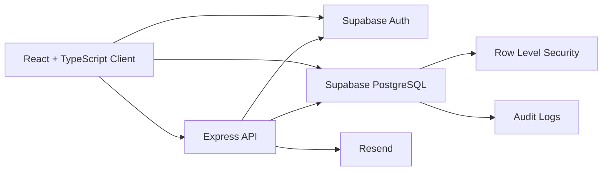

<div align="center">

# ServEase

**Full-stack appointment and business operations platform for service-based businesses**

[Live Demo](https://servease-iota.vercel.app/) ·
[Technical Documentation](https://gitdocify.com/Anna-Vida/ServEase) ·
[GitHub Repository](https://github.com/Anna-Vida/ServEase)


</div>

---

## Overview

ServEase is a full-stack business operations and appointment management platform built for service-based businesses. It combines customer booking, staff workflows, service management, payment tracking, analytics, audit logging, authentication, and email notifications in one application.

The project is designed around real operational workflows rather than isolated CRUD screens. It includes dedicated interfaces and authorization rules for **customers, staff, and administrators**, backed by Supabase PostgreSQL and an Express API.

## What This Project Demonstrates

- Multi-role authentication and authorization
- Full-stack React + Express architecture
- PostgreSQL data modeling with Supabase
- Row Level Security for database access control
- Booking and staff-assignment workflows
- Revenue and operational analytics
- Audit logging for administrative actions
- Secure server-side email notification flow
- Frontend and backend automated testing
- CI configuration and production frontend deployment

---

## User Roles

| Role | Main capabilities |
| --- | --- |
| **Customer** | Register, sign in, browse services, create appointments, track bookings, view assigned staff and payment information, cancel eligible pending appointments |
| **Staff** | Access assigned appointments, review customer/service details, and update appointment status |
| **Administrator** | Manage bookings, staff, customers, services, payments, analytics, audit logs, staff assignments, and booking statuses |

---

## Architecture



### Frontend

The frontend is a React single-page application built with TypeScript, Vite, Tailwind CSS, React Router, Lucide React, and Recharts.

### Backend

The Express API handles server-side functionality that should not be trusted to the browser, including authenticated notification requests and Resend email delivery.

### Database and Authentication

Supabase provides:

- PostgreSQL database
- Authentication
- Row Level Security
- User/profile relationships
- Appointment, payment, service, staff, and audit data

---

## Core Features

### Appointment Management

Customers can create appointment requests using active services stored in Supabase.

Each appointment can contain:

- Customer
- Service
- Appointment date
- Appointment time
- Notes
- Assigned staff member
- Booking status

Supported statuses:

- Pending
- Confirmed
- Completed
- Cancelled

Administrators can assign or unassign staff and manage booking statuses. Staff members can work with appointments assigned to them.

### Admin Analytics

The admin dashboard reads live application data and provides:

- Total bookings
- Total customers
- Active staff
- Paid revenue
- Booking status distribution
- Monthly revenue trends
- Today's appointments

Charts are rendered with Recharts.

### Customer Management

Administrators can search and review registered customer profiles by:

- Name
- Phone number
- Customer ID
- Registration date

### Staff Management

Administrators can review staff records and manage active staff used for appointment assignment.

Staff profiles include information such as:

- Name
- Position
- Contact information
- Bio
- Account status

### Service Management

Administrators can:

- Create services
- Edit service information
- Set prices
- Set duration
- Activate or deactivate services

Customers only see active services when booking.

### Payment Tracking

Administrators can record and update appointment-related payments.

Payment data includes:

- Appointment
- Customer
- Service
- Amount
- Payment method
- Payment status
- Payment date

Supported payment statuses:

- Pending
- Paid
- Failed
- Refunded

### Audit Logging

ServEase records important operational and administrative actions, including:

- Booking status changes
- Customer cancellations
- Staff assignments and unassignments
- Payment creation and status changes
- Service creation and updates
- Service activation and deactivation

Audit records include the authenticated user, action type, affected entity, metadata, and timestamp.

---

## Email Notifications

ServEase integrates with the **Resend API** through the Express backend.

Booking confirmation flow:

```text
Customer creates appointment
        ↓
Supabase stores booking
        ↓
Frontend sends booking ID + authenticated session token
        ↓
Express verifies the Supabase user
        ↓
Backend confirms booking ownership
        ↓
Trusted booking data is loaded from the database
        ↓
Resend sends the confirmation email
```

The browser does not provide trusted booking or customer information directly to the email provider.

Email delivery failure does not roll back an appointment that was already created successfully.

> The notification integration is covered by mocked automated tests. Production email delivery still requires a verified sending domain and a deployed backend.

---

## Tech Stack

| Area | Technologies |
| --- | --- |
| **Frontend** | React 19, TypeScript, Vite, React Router, Tailwind CSS 4, Lucide React, Recharts |
| **Backend** | Node.js, Express 5, TypeScript, Helmet, CORS, Morgan |
| **Database / Auth** | Supabase, PostgreSQL, Supabase Auth, Row Level Security |
| **Email** | Resend |
| **Testing** | Vitest, React Testing Library, jsdom, Supertest |
| **Code Quality** | Oxlint, TypeScript |
| **CI** | GitHub Actions |
| **Deployment** | Vercel frontend, Supabase database/auth |

---

## Database

Primary tables:

```text
profiles
services
staff_profiles
appointments
payments
audit_logs
```

Row Level Security is used to restrict database operations according to authenticated identity and role.

Examples include:

- Customers accessing their own appointment data
- Staff accessing assigned appointments
- Customers viewing their own payment information
- Administrators managing operational records
- Administrative access to audit logs

Database schema and migration files are available under [`supabase/`](./supabase).

---

## Project Structure

```text
ServEase/
├── .github/
│   └── workflows/
│       └── ci.yml
├── client/
│   ├── public/
│   ├── src/
│   │   ├── lib/
│   │   ├── pages/
│   │   ├── test/
│   │   ├── App.tsx
│   │   └── main.tsx
│   ├── .env.example
│   ├── package.json
│   ├── vercel.json
│   └── vite.config.ts
├── server/
│   ├── src/
│   │   ├── lib/
│   │   ├── middleware/
│   │   ├── routes/
│   │   ├── services/
│   │   ├── app.ts
│   │   └── server.ts
│   ├── .env.example
│   ├── package.json
│   └── tsconfig.json
├── supabase/
│   ├── migrations/
│   ├── README.md
│   └── schema.sql
├── package.json
└── README.md
```

---

## Application Routes

| Route | Access | Description |
| --- | --- | --- |
| `/login` | Public | User login |
| `/register` | Public | Customer registration |
| `/customer` | Customer | Customer dashboard |
| `/book` | Customer | Appointment booking |
| `/staff` | Staff | Staff dashboard |
| `/admin` | Admin | Admin analytics dashboard |
| `/admin/bookings` | Admin | Booking management |
| `/admin/customers` | Admin | Customer management |
| `/admin/staff` | Admin | Staff management |
| `/admin/services` | Admin | Service management |
| `/admin/payments` | Admin | Payment management |
| `/admin/audit-logs` | Admin | Audit log viewer |

---

## Getting Started

### Requirements

Install:

- Node.js 24
- npm
- Git

You also need:

- A Supabase project
- A Resend account if you want to test email notifications

### Clone the Repository

```bash
git clone https://github.com/Anna-Vida/ServEase.git
cd ServEase
```

### Install Dependencies

Frontend:

```bash
cd client
npm install
```

Backend:

```bash
cd ../server
npm install
```

---

## Environment Variables

### Frontend

Create `client/.env`:

```env
VITE_SUPABASE_URL=your_supabase_project_url
VITE_SUPABASE_PUBLISHABLE_KEY=your_supabase_publishable_key
VITE_API_URL=http://localhost:5000
```

### Backend

Create `server/.env`:

```env
PORT=5000

SUPABASE_URL=your_supabase_project_url
SUPABASE_PUBLISHABLE_KEY=your_supabase_publishable_key

RESEND_API_KEY=your_resend_api_key
NOTIFICATION_WEBHOOK_SECRET=your_secure_webhook_secret
```

Do not commit real `.env` files or API keys. Safe templates are included as `.env.example` files.

---

## Running Locally

Use two terminals.

### Frontend

```bash
cd client
npm run dev
```

Default development URL:

```text
http://localhost:5173
```

### Backend

```bash
cd server
npm run dev
```

Default backend URL:

```text
http://localhost:5000
```

Health check:

```text
GET /api/health
```

---

## Testing

### Frontend

```bash
cd client
npm test
```

### Backend

```bash
cd server
npm test
```

The currently documented local suite contains:

```text
Frontend: 8 tests
Backend:  8 tests
Total:   16 tests
```

External Supabase and Resend calls are mocked during relevant automated tests.

---

## Production Builds

Frontend:

```bash
cd client
npm run build
```

Backend:

```bash
cd server
npm run build
```

---

## Continuous Integration

The repository includes [`.github/workflows/ci.yml`](./.github/workflows/ci.yml).

For pushes and pull requests to `main`, the workflow is configured to run:

**Frontend**

```text
npm ci
  ↓
lint
  ↓
tests
  ↓
production build
```

**Backend**

```text
npm ci
  ↓
tests
  ↓
TypeScript build
```

Local tests and builds have passed. GitHub-hosted CI execution has not yet been successfully verified because the workflow was previously blocked by an account billing issue.

---

## Deployment Status

### Frontend

The React frontend is deployed on Vercel:

**https://servease-iota.vercel.app/**

The Vercel project is connected to the GitHub repository and can deploy frontend updates from the configured production branch.

### Backend

The Express backend currently runs locally during development and still needs a production cloud deployment.

Until the backend is deployed, backend-dependent features such as production Resend email notifications will not work from the live Vercel frontend.

---

## Security

ServEase currently uses:

- Supabase Auth
- Role-based route protection
- PostgreSQL Row Level Security
- Authenticated Express API routes
- Booking ownership validation
- Environment-based secret management
- Helmet security headers
- Protected server-to-server webhook endpoint

The Resend API key and webhook secret remain on the server.

---

## Current Status

### Completed

- Authentication
- Role-based authorization
- Customer dashboard
- Staff dashboard
- Admin dashboard
- Appointment booking
- Booking management
- Staff assignment
- Customer management
- Staff management
- Service management
- Payment tracking
- Revenue analytics
- Audit logging
- Responsive interface
- Supabase Row Level Security
- Authenticated Express notification API
- Booking confirmation email integration
- Frontend automated tests
- Backend API tests
- GitHub Actions CI configuration
- Vercel frontend deployment

### Planned Improvements

- Deploy the Express backend
- Verify a production email domain
- Expand automated test coverage
- Strengthen appointment cancellation security
- Prevent duplicate payment records
- Add route-level code splitting and performance optimization
- Perform a production security review

---

## Documentation

Additional repository documentation is available through GitDocify:

**https://gitdocify.com/Anna-Vida/ServEase**

This provides a deeper code-oriented view of the repository, while this README focuses on the project overview, architecture, setup, and development status.

---

## Author

**Anna Patricia B. Vida**

- GitHub: [Anna-Vida](https://github.com/Anna-Vida)
- LinkedIn: [annavida12](https://www.linkedin.com/in/annavida12/)

---

## Project Status

ServEase is under active development and continues to receive improvements in deployment, testing, security, performance, and integrations.